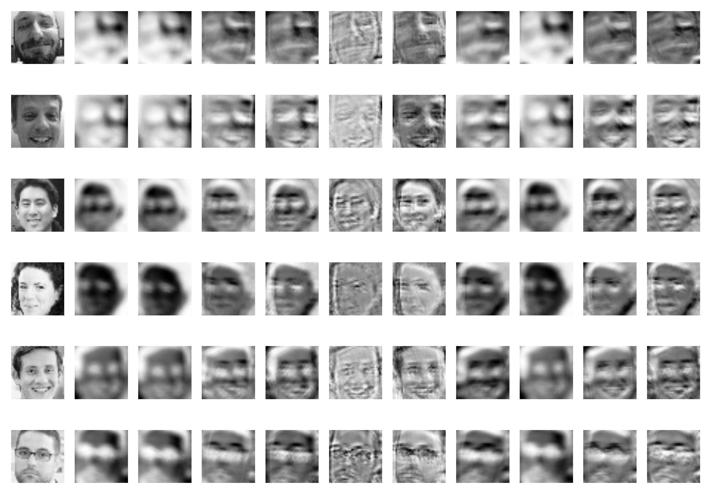

# Emotion Detection In Images

We implemented a pattern recognition framework to recognize emotion in static facial expressions. Our methods are based on the paper ”Hierarchical Committee of Deep CNNs with Exponentially-Weighted Decision Fusion for Static Facial Expression Recognition”. The paper’s authors achieved an accuracy of 61.6% classifying all seven basic emotions. We built a convolutional neural network (CNN) and classified photos with an accuracy of 67.67%. In addition to classifying the seven emotions, we built CNNs and support vector machines (SVMs) to classify facial images as expressing one of two emotions. While we trained and tested models for all pairs of emotions, our best models were trained on images labeled as “Happy” or as “Disgust”. Our CNN model achieved 96.69% test.

## Data Sets
* Dhall, Abhinav. Third Emotion Recognition in the Wild Challenge results @ ACM ICMI  [link](https://sites.google.com/site/dhallabhinav/home/emotiw2015)
* Japanese Female Facial Expression (JAFFE) Database.  [link](http://www.kasrl.org/jaffe.html)
* Challenges in Representation Learning: Facial Expression Recognition Challenge. [link](https://www.kaggle.com/c/challengesin-representation-learning-facialexpression-recognition-challenge)

## Sample Outputs from Convolutional Neural Network's First Layer

